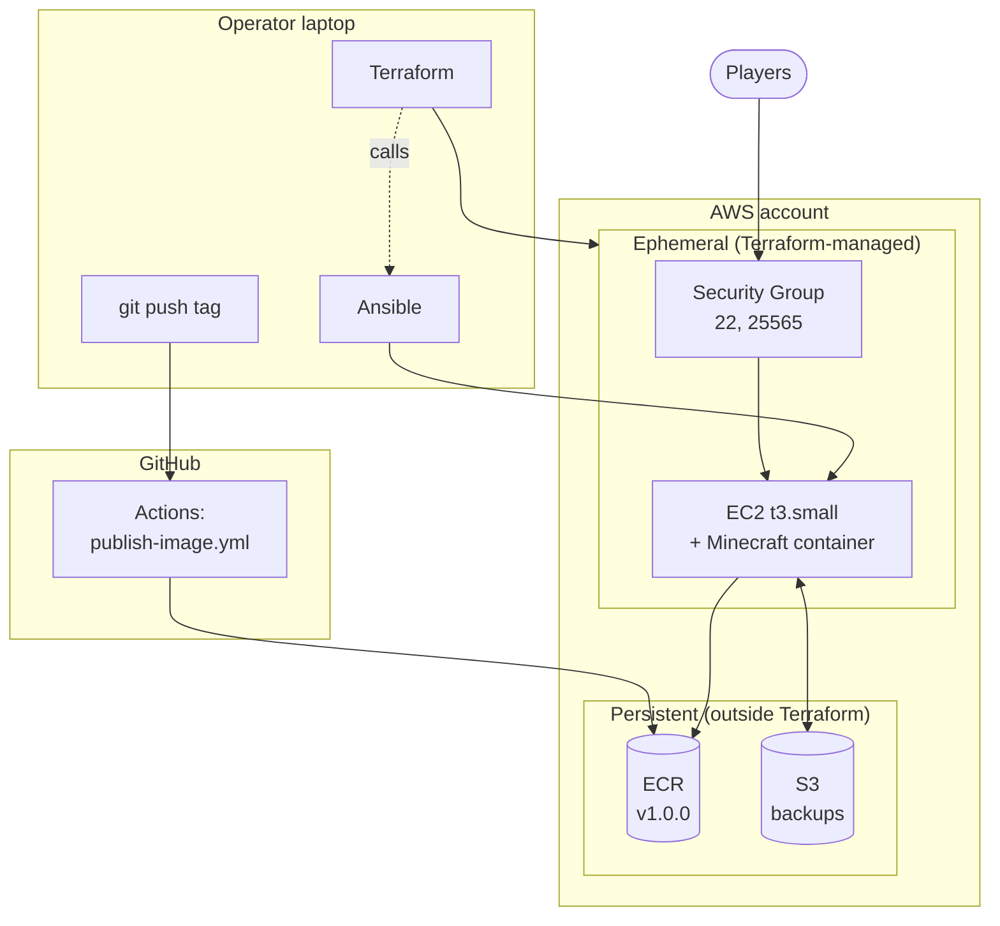

# Ops 3: Infrastructure Automation Runbook

**Name:** Cody Strehlow | **OSUID:** 934609212 | **ONID:** strehloc

[Link to narrated screen recording](TODO: paste your media.oregonstate.edu URL after upload)

[Link to GitHub repository](TODO: paste your public repo URL)

## Table of Contents

1. [Infrastructure Overview](#1-infrastructure-overview)
2. [Architecture Diagram](#2-architecture-diagram)
3. [Design Note](#3-design-note)
4. [Terraform Inputs and Variables](#4-terraform-inputs-and-variables)
5. [One-Time Bootstrap: ECR and S3](#5-one-time-bootstrap-ecr-and-s3)
6. [Day-to-Day Workflow: terraform apply](#6-day-to-day-workflow-terraform-apply)
7. [Image Publishing Pipeline (GitHub Actions)](#7-image-publishing-pipeline-github-actions)
8. [Ansible Playbook Reference](#8-ansible-playbook-reference)
9. [World Data Recovery Strategy](#9-world-data-recovery-strategy)
10. [Operator Procedures](#10-operator-procedures)
11. [Change Process](#11-change-process)
12. [Teardown Checklist](#12-teardown-checklist)
13. [Cost-Control Strategy](#13-cost-control-strategy)
14. [Sources](#14-sources)

---

## 1. Infrastructure Overview

| Property | Value |
|---|---|
| Cloud Provider | AWS (Academy) |
| Provisioning Tool | Terraform 1.6 (AWS provider ~> 5.0) |
| Configuration Tool | Ansible 2.14+ |
| CI/CD | GitHub Actions (tag-triggered) |
| Instance Type | t3.small (2 vCPU, 2 GB RAM) |
| Root Volume | 20 GB gp3 |
| AMI | Ubuntu Server 24.04 LTS (looked up dynamically via data source) |
| IAM | `LabInstanceProfile` (contains `LabRole`) |
| Container Engine | Docker Engine (Docker CE) |
| Base Image | `itzg/minecraft-server:java21` |
| Minecraft Version | 1.21.1 (set via `VERSION` env var) |
| Image Registry | Amazon ECR (private) — `<acct>.dkr.ecr.us-east-1.amazonaws.com/ops3-minecraft-server` |
| Pinned Image Tag | `v1.0.0` |
| Backup Bucket | `ops3-minecraft-backups-<acct>` (private, versioned, 7-day expiration) |
| Minecraft Port | 25565/tcp (public) |
| Bind Mount Path (host) | `/opt/minecraft/data` |
| Bind Mount Path (container) | `/data` |
| Backup Script Location | `/usr/local/bin/minecraft-backup.sh` |
| Auto-Restart | `restart: unless-stopped` (container) + systemd-enabled Docker daemon |

**Security Group Inbound Rules:**

| Port | Protocol | Source | Purpose |
|---|---|---|---|
| 22 | TCP | `var.ssh_allowed_cidr` (defaults to 0.0.0.0/0; tighten to your-ip/32) | SSH administration |
| 25565 | TCP | 0.0.0.0/0 | Minecraft player connections |

**Stateful vs Immutable:**

| Component | Type | Notes |
|---|---|---|
| EC2 instance, security group, inventory file | Ephemeral (Terraform-managed) | Created and destroyed by `terraform apply` / `destroy` |
| ECR repository + pushed images | Persistent (outside Terraform) | Created once via AWS CLI; referenced by Terraform as a data source |
| S3 backup bucket + objects | Persistent (outside Terraform) | Created once via AWS CLI; survives `terraform destroy` |
| `/opt/minecraft/data` on the EC2 host | Stateful (transient) | World data; lost when EC2 is destroyed but restored from S3 on next apply |
| Container filesystem (outside `/data`) | Ephemeral | Discarded on container recreation; rebuilt from the pinned image |

---

## 2. Architecture Diagram



Three operational planes:

- **Operator laptop** runs Terraform (provisioning) and Ansible (configuration). Tags pushed from the repo trigger the pipeline.
- **GitHub** runs the image publishing pipeline. On a `v*` tag push, the workflow pulls the upstream itzg image, smoke-tests it, and pushes it to ECR.
- **AWS account** holds two layers. Persistent resources (ECR, S3) live outside Terraform and survive any `destroy`. Ephemeral resources (EC2, SG) are Terraform-managed and rebuilt routinely. The EC2 container pulls from ECR via the instance role and writes hourly backups to S3.

---

## 3. Design Note

The system automates a Minecraft server across three layers: Terraform
provisions infrastructure, Ansible configures the host, and GitHub Actions
publishes container images. Each layer has one responsibility and one mechanism
for change. Together they replace the hand-built workflow that the intern
erased.

**State separation between compute and storage.** ECR and S3 are created via
the AWS CLI and read by Terraform as data sources, not managed resources.

**Idempotent configuration.** The Ansible playbook is built around modules that
check state before changing it (`apt`, `service`,
`community.docker.docker_container`) and uses `creates:` markers for shell
tasks. A second run against a configured host yields `changed=0` in PLAY RECAP.
This is what makes the playbook safe to re-trigger on every `terraform apply`.

**Authentication via instance profile.** The EC2 instance authenticates to ECR
and S3 using `LabInstanceProfile` credentials retrieved at runtime via IMDSv2.
No long-lived AWS keys are written to disk on the host. The Ansible playbook
calls `aws ecr get-login-password` and `aws s3 cp` directly; the AWS CLI
handles the IMDSv2 token exchange transparently.

**Sizing.** `t3.small` (2 GB RAM) is the smallest type that leaves headroom for
the JVM heap (~1 GB), the OS, and Docker. `t3.micro` (1 GB total) starves the
JVM. `t3.medium` (4 GB) would be more comfortable but doubles the cost without
practical benefit at single-server scale. The same sizing carried forward from
Ops 2.

**Terraform-to-Ansible handoff.** A `null_resource` with two `local-exec`
provisioners runs after the EC2 instance is created. The first provisioner is a
retry loop that polls SSH every 10 seconds for up to 5 minutes (handling the
period after AWS reports the instance "running" but before `sshd` is
listening). Once SSH connects, it runs `cloud-init status --wait` to ensure the
Python 3 bootstrap is complete. The second provisioner invokes
`ansible-playbook`. The `null_resource` re-runs whenever the instance ID
changes (rebuild) or the playbook's SHA-256 changes (edit), giving the deploy
pipeline the same trigger-on-change ergonomics as a CI build.

**Pipeline approach.** The GitHub Actions workflow re-tags the upstream
`itzg/minecraft-server:java21` image and pushes it to ECR under the pushed git
tag. This is the simpler of the two approaches Ops 3 permits (the other being
building from a custom Dockerfile, which would have been required if Ops 2's
extra credit had been completed). The smoke test polls `docker logs` for the
`Done (` string that the itzg image prints on initialization completion,
satisfying the assignment's hint that an immediate-check smoke test will always
fail because Minecraft takes 30-60 seconds to start.

---

## 4. Terraform Inputs and Variables

All variables are declared in `terraform/variables.tf` and have values set in
`terraform/terraform.tfvars` (gitignored).


| Variable | Type | Purpose | Default | Used by |
|---|---|---|---|---|
| `key_name` | string | Existing AWS EC2 key pair name for SSH access | required | `aws_instance.minecraft` |
| `ssh_allowed_cidr` | string | CIDR allowed to reach port 22 | `0.0.0.0/0` | `aws_security_group.minecraft` |
| `instance_type` | string | EC2 instance type | `t3.small` | `aws_instance.minecraft` |
| `backup_bucket` | string | Name of externally-managed S3 backup bucket | required | `data.aws_s3_bucket.backups` |


`terraform.tfvars` example contents:

```hcl
key_name      = "cs312-key"
backup_bucket = "ops3-minecraft-backups-413777480403"
```

**Data sources (read existing AWS resources, not managed):**

| Data Source | Reads |
|---|---|
| `data.aws_vpc.default` | Academy-provided default VPC |
| `data.aws_subnets.default` | Subnets in the default VPC |
| `data.aws_ami.ubuntu` | Latest Ubuntu 24.04 LTS AMI from Canonical (owner `099720109477`) |
| `data.aws_ecr_repository.minecraft` | ECR repo created via the bootstrap section |
| `data.aws_s3_bucket.backups` | Backup bucket created via the bootstrap section |


**Outputs:**

| Output | Purpose |
|---|---|
| `instance_public_ip` | Public IPv4 of the EC2 instance |
| `instance_id` | EC2 instance ID |
| `ssh_command` | Ready-to-paste SSH command |
| `ecr_repository_url` | ECR URL (read from data source) |
| `backup_bucket_name` | S3 bucket name (read from data source) |

---

## 5. One-Time Bootstrap: ECR and S3

These commands create the persistent resources that Terraform references but
does not manage. Run once per AWS account. Re-run only when setting up the
project in a new account.

```bash
ACCOUNT_ID=$(aws sts get-caller-identity --query Account --output text)
BUCKET="ops3-minecraft-backups-${ACCOUNT_ID}"
```

**Create the ECR repository:**

```bash
aws ecr create-repository \
  --repository-name ops3-minecraft-server \
  --region us-east-1
```

**Create and configure the S3 bucket:**

```bash
aws s3api create-bucket --bucket "${BUCKET}" --region us-east-1

aws s3api put-public-access-block \
  --bucket "${BUCKET}" \
  --public-access-block-configuration \
    BlockPublicAcls=true,IgnorePublicAcls=true,BlockPublicPolicy=true,RestrictPublicBuckets=true

aws s3api put-bucket-versioning \
  --bucket "${BUCKET}" \
  --versioning-configuration Status=Enabled

aws s3api put-bucket-lifecycle-configuration \
  --bucket "${BUCKET}" \
  --lifecycle-configuration '{
    "Rules": [{
      "ID": "expire-old-backups",
      "Filter": {},
      "Status": "Enabled",
      "Expiration": { "Days": 7 },
      "NoncurrentVersionExpiration": { "NoncurrentDays": 7 }
    }]
  }'
```

**Verify:**

```bash
aws ecr describe-repositories --repository-names ops3-minecraft-server --region us-east-1
aws s3 ls "s3://${BUCKET}/"
```

---

## 6. Day-to-Day Workflow: terraform apply

`terraform apply` provisions infrastructure *and* runs the Ansible playbook in
a single command. This covers initial provisioning, rebuilds after destroy, and
deploying playbook edits.

```bash
cd terraform/
terraform apply
```

**What happens, in order:**

1. Terraform refreshes the data sources (VPC, AMI, ECR, S3 bucket).
2. `aws_security_group.minecraft` is created (or recognized as unchanged).
3. `aws_instance.minecraft` is created with `LabInstanceProfile` attached.
4. `local_file.ansible_inventory` writes `ansible/inventory.ini` using the new instance's public IP.
5. `null_resource.ansible_provision` runs two `local-exec` provisioners:
   - Loops on SSH connectivity (10-second intervals, 5-minute cap), then runs `cloud-init status --wait` to confirm Python 3 is installed.
   - Runs `ansible-playbook playbook.yml`.
6. The playbook installs Docker, AWS CLI, and the Python Docker SDK; authenticates to ECR; checks `/opt/minecraft/data` and S3 for backup data; restores from S3 if data is empty and a backup exists; installs the backup script and cron job; starts the Minecraft container.
7. Terraform prints outputs (public IP, SSH command, ECR URL, bucket name).

**Expected timing:**

- First-time provision: ~5 minutes (most time spent in AWS CLI install and Docker setup).
- Rebuild against existing storage: ~5 minutes (similar; restore adds ~10 seconds).
- Re-run against configured host (no instance ID change, no playbook change): seconds; the `null_resource` does not re-fire.

**Verifying success:**

```bash
# Container is up and on the pinned image
ssh -i ~/.ssh/cs312-key.pem ubuntu@$(terraform output -raw instance_public_ip) \
  'sudo docker ps --filter name=minecraft --format "table {{.Names}}\t{{.Image}}\t{{.Status}}"'

# Service is reachable with the custom MOTD
nmap -sV -Pn -p T:25565 $(terraform output -raw instance_public_ip)
```

Expected `nmap` output:

```
25565/tcp open  minecraft Minecraft 1.21.1 (Protocol: 127, Message: strehloc's minecraft server, Users: 0/20)
```

---

## 7. Image Publishing Pipeline (GitHub Actions)

**Workflow file:** `.github/workflows/publish-image.yml`

**Trigger:** push of a git tag matching `v*` (e.g., `v1.0.0`). Normal commits to `main` do not trigger a build.

**Steps:**

1. Checkout the repository.
2. Configure AWS credentials from three repo secrets (Academy session credentials).
3. Login Docker to ECR.
4. Pull the upstream image `itzg/minecraft-server:java21`.
5. Smoke test: start the container with `EULA=TRUE` and `VERSION=1.21.1`, then poll `docker logs` for up to 180 seconds looking for the `Done (` string. Fails the workflow if the string is not seen.
6. Tag the image as `<ECR-URL>:<git-tag>` and push to ECR.

**Required GitHub Actions secrets:**

| Secret | Source |
|---|---|
| `AWS_ACCESS_KEY_ID` | AWS Academy → AWS Details → AWS CLI |
| `AWS_SECRET_ACCESS_KEY` | Same |
| `AWS_SESSION_TOKEN` | Same |

All three are required because Academy uses temporary STS credentials. They expire when the lab session ends and must be refreshed in the GitHub repo settings.

**Releasing a new image version:**

```bash
git tag vX.Y.Z
git push origin vX.Y.Z
```

Watch the workflow in the Actions tab. Once it completes successfully, verify:

```bash
aws ecr describe-images --repository-name ops3-minecraft-server \
  --query 'imageDetails[*].imageTags' --output table
```

To deploy the new tag, edit `ansible/playbook.yml` and change `image_tag:
v1.0.0` to the new tag, then run `terraform apply`. The playbook's SHA-256
change triggers a re-run of the `null_resource`, the `docker_container` task
detects the changed image, and the container is recreated against the same
`/data` volume (world preserved).

---

## 8. Ansible Playbook Reference

**Playbook:** `ansible/playbook.yml`
**Inventory:** `ansible/inventory.ini` (generated by Terraform; gitignored)
**Config:** `ansible/ansible.cfg` (disables host key checking; sets default inventory path)

**Playbook variables:**

| Variable | Value | Purpose |
|---|---|---|
| `aws_region` | `us-east-1` | Region for ECR auth |
| `ecr_repository` | `ops3-minecraft-server` | ECR repo name |
| `image_tag` | `v1.0.0` | Pinned image tag (matches git tag pushed to ECR) |
| `minecraft_version` | `1.21.1` | Minecraft server version (passed to itzg image as `VERSION` env var) |
| `minecraft_memory` | `1G` | JVM heap size |
| `minecraft_motd` | `strehloc's minecraft server` | MOTD displayed to clients; must include name/ONID |
| `data_dir` | `/opt/minecraft/data` | Host directory bind-mounted to `/data` |
| `backup_bucket` | `ops3-minecraft-backups-413777480403` | S3 bucket for world backups |
| `backup_script_path` | `/usr/local/bin/minecraft-backup.sh` | Backup script location |

**Task phases:**

1. **Install prerequisites** — Docker (apt repo + GPG key + engine + service), AWS CLI v2 (Amazon installer), Python Docker SDK (apt).
2. **Authenticate to ECR** — Look up account ID via `aws sts get-caller-identity`, compose registry URL, run `aws ecr get-login-password | docker login` using IMDSv2 credentials.
3. **World restore** — Check whether `/opt/minecraft/data` is empty; check whether `latest.tar.gz` exists in S3; if both true, download and extract.
4. **Backup setup** — Install backup script with the variables baked in; create cron entry (hourly, top of hour).
5. **Run the container** — `community.docker.docker_container` with the pinned image, `EULA=TRUE`, `VERSION`, `MEMORY`, `MOTD` env vars, port 25565 published, `/data` bind-mounted.

**Idempotency:** Re-running the playbook against an already-configured host should produce `changed=0` (or a small number from non-state-changing module reports). The `community.docker.docker_container` module recreates the container only if image, env, ports, or volumes differ.

**Required collection:** `community.docker`. Installed once on the operator's laptop with `ansible-galaxy collection install community.docker`.

---

## 9. World Data Recovery Strategy

**Live world data** lives at `/opt/minecraft/data` on the EC2 host, bind-mounted into the container at `/data`. It survives container recreates but is lost when the EC2 instance is destroyed.

**Backups** are tarballs of `/opt/minecraft/data` written to S3 by a cron job that runs hourly. The script (installed by Ansible at `/usr/local/bin/minecraft-backup.sh`) uploads two objects: a timestamped artifact (`minecraft-<YYYYMMDDTHHMMSS>Z.tar.gz`) and a `latest.tar.gz` pointer that always points to the most recent successful backup. The S3 bucket has versioning enabled and a 7-day lifecycle expiration on objects and non-current versions; storage cost stays bounded.

**Restore on rebuild** is built into the Ansible playbook. Before starting the container, the playbook checks two conditions:

1. Is `/opt/minecraft/data` empty? (Ansible's `find` module reports zero matches.)
2. Does `s3://<bucket>/latest.tar.gz` exist? (`aws s3 ls` returns 0.)

If both are true, the playbook downloads `latest.tar.gz`, extracts it into `/opt/minecraft/data`, and proceeds. If either is false, restore is skipped:

- On a re-run against a configured host, `/data` is non-empty, so live data is preserved.
- On a first-ever run with no backups in S3, restore is skipped and the server generates a fresh world.

The "Log restore outcome" debug task in the playbook prints which branch ran, making the restore behavior visible in the apply output.

**Why this works during rebuild:** The S3 bucket is managed outside Terraform. A `terraform destroy` removes only the EC2 instance, security group, inventory file, and `null_resource`. The backup objects remain in S3. The subsequent `terraform apply` creates a new EC2 instance with an empty `/data`, finds `latest.tar.gz` in the unchanged S3 bucket, and restores. Players reconnect to the same world.

**Demo evidence:** A marker file at `/opt/minecraft/data/world/PERSISTENCE_TEST` is placed before destroy, included in the next backup, and verified present on the rebuilt instance with its original `mtime` intact. The mtime predates the new instance's launch time, which is unambiguous proof that the file came from the restore rather than being freshly generated.

**Manual restore (out-of-band):**

```bash
# On the host
cd /opt/minecraft/data
sudo aws s3 cp s3://ops3-minecraft-backups-413777480403/latest.tar.gz /tmp/restore.tar.gz
sudo docker stop minecraft
sudo rm -rf /opt/minecraft/data/*
sudo tar -xzf /tmp/restore.tar.gz -C /opt/minecraft/data
sudo docker start minecraft
```

---

## 10. Operator Procedures

### 10.1 Refreshing AWS Academy Credentials

Academy credentials expire when the lab session ends. Three refresh targets:

1. **Laptop (`~/.aws/credentials`)** — paste the new block from AWS Academy → AWS Details → AWS CLI. Confirm the `region=us-east-1` line is present (Academy's copyable block does not always include it). Verify: `aws sts get-caller-identity`.
2. **GitHub Actions secrets** — repo Settings → Secrets and variables → Actions. Update `AWS_ACCESS_KEY_ID`, `AWS_SECRET_ACCESS_KEY`, `AWS_SESSION_TOKEN`. Only required if you intend to push a new tag during the current session.
3. **EC2 instance** — no action needed. The instance uses `LabInstanceProfile` via IMDSv2; credentials refresh automatically.

### 10.2 Forcing a Manual Backup

```bash
ssh -i ~/.ssh/cs312-key.pem ubuntu@<public-ip> \
  'sudo /usr/local/bin/minecraft-backup.sh'
```

Expected output ends with `Backup complete: s3://...`. Verify with:

```bash
aws s3 ls s3://ops3-minecraft-backups-<acct>/
```

### 10.3 Inspecting Backup Cron Activity

```bash
ssh -i ~/.ssh/cs312-key.pem ubuntu@<public-ip> 'sudo cat /var/log/minecraft-backup.log'
```

The script writes to this file each hour.

### 10.4 Inspecting Container Logs

```bash
ssh -i ~/.ssh/cs312-key.pem ubuntu@<public-ip> 'sudo docker logs minecraft --tail 100'
```

### 10.5 Deploying a New Image Version

```bash
# Push the tag (triggers GH Actions)
git tag vX.Y.Z
git push origin vX.Y.Z

# Wait for the workflow to complete in the Actions tab.
# Then update the playbook to use the new tag:
sed -i 's/image_tag: v.*/image_tag: vX.Y.Z/' ansible/playbook.yml

# Re-apply (the playbook SHA changes, triggering the null_resource)
cd terraform/
terraform apply
```

The container is recreated against the same `/data` volume; world is preserved.

### 10.6 Checking Service Health

```bash
# From operator laptop
nmap -sV -Pn -p T:25565 <public-ip>

# On the host
ssh -i ~/.ssh/cs312-key.pem ubuntu@<public-ip> \
  'sudo docker ps --filter name=minecraft'
```

Healthy response: `nmap` shows `open` + correct version + correct MOTD; `docker ps` shows `Up`.

### 10.7 IMDSv2 Note

Modern Ubuntu AMIs default to IMDSv2 enforcement. The AWS CLI and SDKs handle this automatically. For ad-hoc curls against the metadata service:

```bash
TOKEN=$(curl -s -X PUT "http://169.254.169.254/latest/api/token" \
  -H "X-aws-ec2-metadata-token-ttl-seconds: 60")
curl -s -H "X-aws-ec2-metadata-token: $TOKEN" \
  http://169.254.169.254/latest/meta-data/iam/security-credentials/
```

Expected: `LabRole`.

---

## 11. Change Process

A teammate proposing or reviewing an infrastructure or configuration change follows this flow:

1. **Branch.** `git checkout -b <descriptive-name>`.
2. **Edit.** Modify Terraform, Ansible, or the workflow file.
3. **Validate locally.**
```bash
   cd terraform/ && terraform fmt -recursive && terraform validate && terraform plan
   ansible-playbook --syntax-check ansible/playbook.yml
```
4. **Open a pull request.** Include the relevant `terraform plan` output in the PR description so the reviewer sees the AWS-side diff alongside the code diff.
5. **Review the code and plan together.** A surprise in the plan is a reason to stop and investigate, not a reason to proceed. The plan should match what the diff implies.
6. **Merge to `main`.**
7. **Apply.** The operator with fresh AWS Academy credentials runs `terraform apply`. If the change touches the container image, push a new git tag first and wait for the pipeline to complete before applying.
8. **Verify.** Confirm `nmap` reports the service healthy, the PLAY RECAP shows `failed=0`, and `docker logs minecraft` does not show errors.

**High-risk changes** (instance type, AMI, data-directory paths, anything touching `/opt/minecraft/data`) require a verified S3 backup before the apply. Force a backup via §10.2.

---

## 12. Teardown Checklist

### 12.1 Routine Teardown (between work sessions)

Use this to drive EC2 cost to zero between sessions while preserving the image in ECR and world backups in S3.

1. Force a fresh backup if one isn't recent:
```bash
   aws s3 ls s3://ops3-minecraft-backups-<acct>/
   # If latest.tar.gz mtime is stale:
   ssh -i ~/.ssh/cs312-key.pem ubuntu@<public-ip> \
     'sudo /usr/local/bin/minecraft-backup.sh'
```
2. Destroy the compute layer:
```bash
   cd terraform/
   terraform destroy
```
3. Verify only compute resources were destroyed:
```bash
   terraform state list   # should be empty
   aws s3 ls s3://ops3-minecraft-backups-<acct>/   # backups still there
   aws ecr describe-images --repository-name ops3-minecraft-server   # image still there
```

### 12.2 Full Teardown (project complete)

Run after routine teardown to remove the persistent resources and drive total cost to zero.

```bash
ACCOUNT_ID=$(aws sts get-caller-identity --query Account --output text)
BUCKET="ops3-minecraft-backups-${ACCOUNT_ID}"

# Empty and delete S3 bucket
aws s3 rm "s3://${BUCKET}" --recursive
aws s3api delete-bucket --bucket "${BUCKET}" --region us-east-1

# Delete ECR repo (--force allows non-empty)
aws ecr delete-repository \
  --repository-name ops3-minecraft-server \
  --force \
  --region us-east-1
```

Verify:

```bash
aws ec2 describe-instances \
  --filters "Name=tag:Name,Values=ops3-minecraft" \
            "Name=instance-state-name,Values=running,stopped" \
  --query 'Reservations[*].Instances[*].InstanceId' --output text
aws s3 ls | grep ops3
aws ecr describe-repositories --repository-names ops3-minecraft-server 2>&1 | grep RepositoryNotFound
```

Expected: empty, empty, `RepositoryNotFoundException`.

---

## 13. Cost-Control Strategy

### Instance Sizing

`t3.small` is the smallest size that practically runs the JVM + OS + Docker without thrashing. Justified in §3 (Design Note). Same sizing as Ops 2.

### Stop vs Destroy

Two ways to halt EC2 charges between sessions:

- **Stop** the instance (AWS console → EC2 → Instances → select → Instance state → Stop). Halts compute billing; EBS volume still charged (small). World data on the volume is preserved. Restart and the container comes back automatically via the Docker daemon's systemd unit and the container's restart policy.
- **`terraform destroy`** (recommended). Removes all compute resources. EBS is gone with the instance. World data is preserved via the most recent S3 backup. Cost drops to zero (plus negligible S3 and ECR storage). Next `terraform apply` rebuilds with the restored world.

Routine teardown is the cleaner discipline because it forces the rebuild path to be exercised regularly, which catches drift before it becomes a problem.

### S3 Storage

The lifecycle rule in §5 expires backup objects and non-current versions after 7 days. Minecraft worlds at this scale are tens of MB; even with hourly backups, weekly storage stays well under $0.01.

### ECR Storage

Each pushed image is ~600 MB. One pinned image is fine. If the project grows past a handful of tags, add an ECR lifecycle policy to keep only the most recent N builds.

### Guardrails

- Never leave the EC2 instance running overnight or over weekends if not in use.
- Set an AWS billing alert under **Billing → Budgets**.
- Run routine teardown (§12.1) at the end of every work session.
- Remove the `25565/tcp` security group rule when no players are actively connecting if leaving the instance up.

### Expected Steady-State Cost

| Component | Approximate cost |
|---|---|
| `t3.small` EC2 (us-east-1, on-demand, 1 hour) | A few cents per hour. Exact pricing changes; check the AWS pricing page for current values. |
| 20 GB gp3 EBS (1 month) | Single-digit dollars. |
| S3 storage (tens of MB) | Negligible (<$0.01/month). |
| ECR storage (one ~600 MB image) | Negligible (<$0.10/month). |
| Data transfer out (one Minecraft client session) | Negligible at hobby scale. |

The dominant cost is whether the EC2 instance is running. A weekend of forgotten 24/7 uptime is more expensive than a month of careful start/stop discipline.

---

## 14. Sources

- Course lecture notes, labs, and activites
- [`itzg/minecraft-server` documentation](https://docker-minecraft-server.readthedocs.io/en/latest/) used to confirm `EULA`, `VERSION`, `MEMORY`, and `MOTD` environment variable semantics, and the `Done (` log line used in the smoke test.

Note on AI usage: I used Claude to help structure this runbook and verify that my methods were satisfying the rubric requirements, but all design decisions and EC2 execution on the host were done by me.
